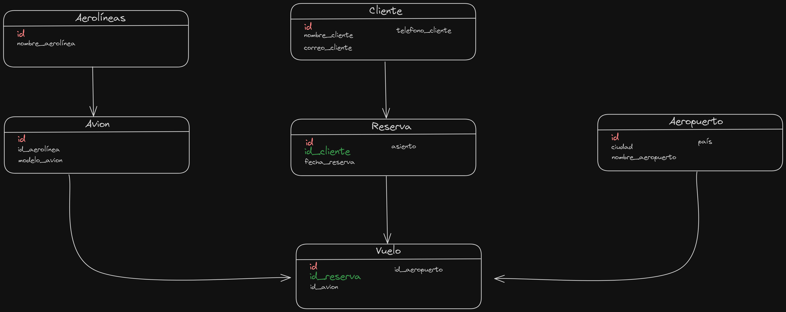

# Flask & Pythonanywhere

Un nuevo proyecto Flutter.

## Getting Started

Esta actividad fue desarrollada en flutter, que nos permite evidenciar el manejo de datos con el lenguaje de programación Python utilizando el framework Flask y otras dependencias encontradas en el archivo requirements.txt

## Uso

1. Clona este repositorio en tu máquina local.
2. Instalar flutter y todas sus dependencias.
3. crear un entorno de trabajo con el siguiente comando virtualenv (nombreDeTuEntornoDeTrabajo)
4. Acceder al entorno de trabajo que se creo e instalar requirements.txt con pip install -r requirements.txt
5. Descargar e installer el archivo .json que esta en el package  postmant

La siguiente foto es el diagrama E/R del proyecto, con sus respectivas clases y atributos

## Desarrollo 
El proyecto fue desarrollado por:

* Juan Camilo Barrios Badel
