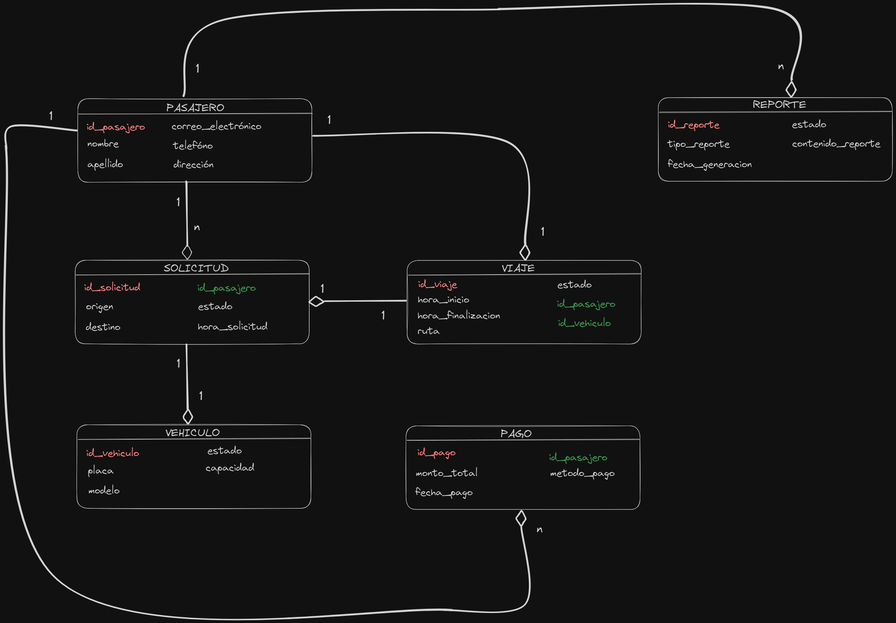

# Flask & Pythonanywhere

Un nuevo proyecto Flutter.

## Getting Started

Este proyecto es el parcial de Móvil 2, donde será desarrollado en Python, flask y su despliegue en PtythonAnywhere, y la descripción del problema es el siguiente: 

La empresa Sistema Tecnológico de Innovación, dedicada al transporte puerta a puerta entre ciudades, enfrenta desafíos logísticos que afectan su rentabilidad. Actualmente, el proceso de solicitud de vehículos y registro de viajes se realiza manualmente, generando complicaciones en la administración financiera y pérdidas económicas.

## Desarrollo propuesto 

Se requiere la creación de un aplicativo que optimice la administración de recursos, mejorando la eficiencia en la recolección y transporte de pasajeros.

## Uso

1. Clona este repositorio en tu máquina local.
2. Instalar flutter y todas sus dependencias.
3. Crear un entorno de trabajo con el siguiente comando virtualenv (nombreDeTuEntornoDeTrabajo)
4. Acceder al entorno de trabajo que se creo e instalar requirements.txt con pip install -r requirements.txt
5. Descargar e instalar el archivo .json que esta en el package  postmant

La siguiente foto es el diagrama E/R del proyecto, con sus respectivas clases y atributos

## Desarrollo 
El parcial fue desarrollado por:

* Juan Camilo Barrios Badel
* Jeider Alexander Foronda Pacheco
